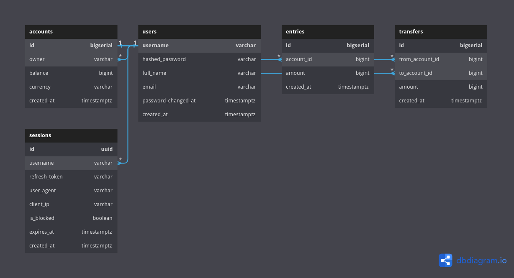

# Description

This is my attempt to rewrite simple bank web service based on the [Backend Master Class [Golang + Postgres + Kubernetes + gRPC]](https://www.udemy.com/course/backend-master-class-golang-postgresql-kubernetes/) course.

It will be rewritten using GORM ORM library and Gin Gonic web framework.

## Database Diagram

For more information about the database, please refer to the [database documentation site](https://dbdocs.io/bagashiz/simple_bank/).

## Dependencies

- [Go](https://go.dev/) version 1.19 or later
- [Podman](https://podman.io/) or [Docker](https://www.docker.com/)
- [PostgreSQL Container Image](https://hub.docker.com/_/postgres/)
- [Gin Gonic](https://github.com/gin-gonic/gin/)
- [GORM](https://gorm.io/)

## Learning and Reference Sources

- [Backend Master Class [Golang + Postgres + Kubernetes + gRPC]](https://www.udemy.com/course/backend-master-class-golang-postgresql-kubernetes/) by TECH SCHOOL
- [Go Documentation](https://go.dev/doc/)
- [Podman Documentation](https://docs.podman.io/en/latest/)
- [Postgresql Documentation](https://www.postgresql.org/docs/current/)
- [Gin Gonic Documentation](https://gin-gonic.com/docs/)
- [GORM Documentation](https://gorm.io/docs/)
